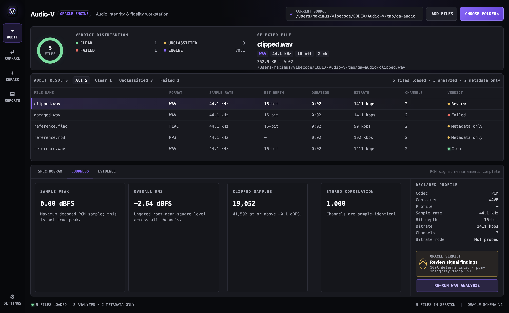
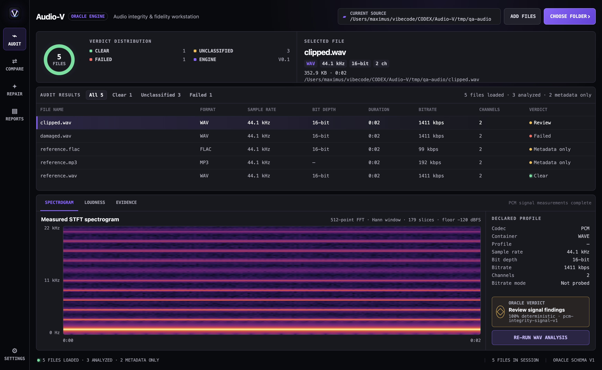

<div align="center">
  
  <h1>Audio-V</h1>
  <p><strong>Audit the file. See the evidence. Understand the verdict.</strong></p>
  <p>A cross-platform audio integrity, fidelity, and comparison workstation powered by the Oracle Engine.</p>

  <p>
    
    <a href="https://github.com/DRAZY/Audio-V/releases/latest"></a>
    <a href="https://github.com/DRAZY/Audio-V/releases"></a>
    <a href="LICENSE"></a>
    
  </p>

  <p>
    <a href="https://github.com/DRAZY/Audio-V/stargazers"></a>
    
    
    
    
  </p>

  <p>
    <a href="#download-audio-v">Download</a> ·
    <a href="#why-audio-v-stands-out">Why Audio-V</a> ·
    <a href="#your-first-audit">First audit</a> ·
    <a href="#meet-the-oracle-engine">Oracle Engine</a> ·
    <a href="#how-audio-v-earns-trust">Validation story</a> ·
    <a href="#understanding-the-verdict">Verdicts</a> ·
    <a href="#take-a-tour">Feature tour</a> ·
    <a href="docs/EXTERNAL_IDENTITY_SERVICES.md">Identity setup</a> ·
    <a href="docs/USER_GUIDE.md">User guide</a>
  </p>
</div>


## What is Audio-V?

Audio-V is a desktop application for people who want to inspect music and
audio files without becoming an audio engineer first.

Choose one track, a group of tracks, or a whole music folder. Audio-V reads
each selected audio stream from beginning to end, measures what it finds, and
gives the file a carefully limited verdict:

- **Clear** — the file passed the checks Audio-V performed.
- **Review** — the scan finished, but something deserves a closer look.
- **Failed** — a repeatable integrity check found evidence against the file.

Audio-V is not a music player. It does not judge whether a song is good, and it
does not assume that a large bitrate or “Hi-Res” label means high quality. It
is an inspection desk: decode the file, measure the signal, show the evidence,
and explain the result.

### One file or a whole workstation

Audio-V has two paths through the same Oracle Engine:

- **Quick Inspect** is the lightweight path. Choose one file and get its
  verdict, format, encoded MP3 channel mode, signal, spectrum, integrity, and
  next step on one screen.
- **Deep inspection** adds adjustable spectrograms, evidence lanes, comparison,
  batch processing, reports, history, and collection tools when they are
  needed.

Quick Inspect does not run a weaker scan or invent a simplified verdict. It
summarizes the same complete-stream analysis used by the deeper views. Audio-V
is therefore lightweight to *use for one file*, even though its total scope is
larger than a single-purpose spectrogram viewer.

### Who is it for?

- Music collectors checking a personal library
- Archivists organizing and verifying audio
- DJs and creators checking delivered files
- People comparing an original track with an edited or repaired copy
- Curious listeners learning what technical audio information means
- Developers who need repeatable JSON evidence from a command line

No audio expertise is required. Technical details are available when wanted,
but the main workflow is designed to answer three simple questions:

1. **Could Audio-V read the whole file correctly?**
2. **Did it measure anything that deserves attention?**
3. **What evidence produced the verdict?**

> [!IMPORTANT]
> Audio-V is an unsigned open-source release still completing its broader
> release-candidate acceptance matrix. A Clear verdict means the file passed
> the disclosed checks in this Oracle Engine version. It does not certify an
> original studio master, prove ownership, or guarantee that the audio was
> never transformed.

## Why Audio-V stands out

Many audio tools answer one part of the question. A spectrogram viewer shows
frequency energy. A metadata utility reports what the container declares. A
CD verifier compares a properly assembled rip with a disc database. Audio-V
connects those kinds of evidence into one non-destructive library workflow and
explains what each result can—and cannot—establish.

| Audio-V strength | What it gives you |
|---|---|
| **Complete-stream assessment** | The selected audio stream is decoded from beginning to end instead of judging a filename, header, or short visual sample |
| **Fast first answer, deep evidence behind it** | Quick Inspect puts the verdict, format, encoded MP3 channel mode, signal, spectrum, integrity, and next steps on one screen; every value links back to the same deeper evidence |
| **Narrow, explainable verdicts** | Clear, Review, and Failed follow disclosed precedence; measurements, heuristics, declarations, and deterministic checks remain visibly different |
| **Library-scale operation** | Recursive folders, bounded workers and fingerprint finalization, mounted-source staging, pause, prompt cancellation, checkpoints, adaptive recovery, cache reuse, and compact SQLite history |
| **Deep visual inspection** | Measured waveform and 512–16,384-point spectrogram views with channel isolation, L−R, zoom, pan, regions, scientific palettes, and batch image export |
| **Scientific A/B comparison** | Independent file loading, synchronized visual modes, alignment, gain and polarity estimation, explicit channel mapping, and full-overlap decoded null evidence |
| **Integrity before speculation** | Full decoding, SHA-256 identity, FLAC audio-MD5 verification, external checksum manifests, failure stages, and exact evidence |
| **Signal and delivery diagnostics** | LUFS, LRA, true peak, clipping events, click/pop and stuck-sample candidates, dropout, DC offset, dynamics, bit utilization, ReplayGain, and optional delivery profiles |
| **Identity without verdict inflation** | Local Chromaprint relationships plus optional AcoustID and MusicBrainz context remain separate from audio-quality verdicts |
| **Evidence you can keep** | Per-file inspection, human review disposition, resumable history, privacy-safe acceptance records, JSON automation, and PDF/XLSX/DOCX/CSV reports |
| **Local-first design** | No player, account, advertising, telemetry, automatic upload, or source overwrite |

## How Audio-V earns trust

Audio-V was not built by choosing a few spectral thresholds and calling the
result authoritative. Oracle Engine has to earn every stronger claim.

The project assembled 85 legally acquired, independently tracked reference
recordings from five external datasets. From those references, Audio-V created
2,295 controlled and observational cases covering native audio, known lossy
transcodes, upsampling, intentional low-pass filtering, defects, speech,
narrow-band material, and other difficult cases. Related versions of one
recording stay in the same source group so Oracle cannot appear accurate by
seeing a close relative of its test material during development.

Candidate rules move through separate development, calibration, frozen test,
external challenge, and edge-case populations. Promotion requires measured
sensitivity *and* strict protection against false advisories. Experimental
scores cannot be presented as probabilities, cannot produce `Failed`, and
cannot turn a file into `Clear` merely because a model likes it.

That policy has already stopped a seemingly promising idea from reaching
users. A multivariate candidate performed strongly on controlled material but
misidentified too many legitimate external music, speech, and narrow-band
recordings. Audio-V published the failed result and left Oracle v12 unchanged.
In other words, the validation system did its job: it preferred an honest
**Inconclusive** result over a confident but unreliable story.

Every release also runs the complete production corpus, unit and integration
tests, format fixtures, packaged-runtime checks, accessibility checks, and
release-artifact verification. Audio-V does not claim that heuristics can prove
a studio master or reconstruct an unknowable recording history. It claims
something narrower and more useful: every verdict is bounded by disclosed
evidence, and stronger rules must survive independent tests before they can
affect that verdict.

Read the full, reproducible record in the
[validation story](docs/VALIDATION_STORY.md),
[Oracle calibration log](docs/ORACLE_CALIBRATION.md), and
[machine-readable promotion policy](validation/real-world/origin-promotion-policy.json).

### What “measured spectrogram” means

Audio-V does not market any spectrogram as “100% raw” or as proof of an
untouched studio master. It decodes the selected audio stream, calculates a
short-time Fourier transform (STFT), and discloses the FFT size, window,
channel mode, frequency range, display floor, scale, and palette. Those
settings affect how every spectrogram looks; exposing them makes Audio-V’s
view measurable and reproducible instead of mysterious.

A spectrogram can reveal bandwidth and cutoff patterns. It cannot, by itself,
prove the complete history, authenticity, ownership, or artistic intent of a
recording. Oracle combines it with integrity and signal evidence and labels
uncertain origin findings as Review—not fact.

### Friendly for beginners, deep enough for specialists

| If you are… | Start with… | Go deeper with… |
|---|---|---|
| **A curious listener** | Plain-language verdict and “what to do next” guidance | Spectrogram, loudness, and glossary |
| **A music collector** | Folder audit, verdict sorting, duplicates, and history | Checksums, origin evidence, cue context, and identity services |
| **An audiophile** | Effective bandwidth, bit utilization, clipping, true peak, and channel behavior | High-resolution channel spectrograms, null comparison, and delivery profiles |
| **An archivist or librarian** | Recursive ingest, metadata inventory, hashes, reports, and resumable sessions | External manifests, persistent fingerprints, CLI JSON, and acceptance evidence |
| **A producer, DJ, or engineer** | Loudness, dynamics, defects, Compare, and safe-copy remediation | Region comparison, per-channel diagnostics, ReplayGain, and profile-specific delivery checks |

### Where Audio-V fits

This is positioning, not a claim that one tool replaces every other:

| Tool | Its published center of gravity | Audio-V’s different job |
|---|---|---|
| [Spek](https://www.spek.cc/about) | Fast, approachable single-file spectrogram viewing and image export | Offer an equally direct one-file starting point through Quick Inspect, then extend it to integrity, signal, origin, provenance, delivery, comparison, and reportable evidence |
| [Sonic Visualiser](https://sonicvisualiser.org/features.html) | Highly configurable visualization, annotation, layers, playback, and plugin research | Provide a guided audit and decision workflow without requiring plugin selection or becoming an annotation environment |
| [AudioAuditor](https://audioauditor.org/) | Broad Windows toolkit combining analysis with playback, EQ, lyrics, metadata tools, and experimental detection | Stay cross-platform and assessment-focused, keeping every verdict reproducible and every uncertain claim explicitly limited |
| [CUETools/CTDB](https://cue.tools/wiki/CUETools_Database) and [AccurateRip](https://accuraterip.com/) | Specialized verification of properly contextualized audio-CD extractions against shared databases | Assess ordinary files and libraries broadly; identify disc-verification eligibility without pretending eligibility is a database match |

Audio-V is deliberately not the player, tag editor, or mastering suite in this
list. Its job is to be the evidence desk you can trust before deciding whether
a file is clear, needs review, should be replaced, or deserves a closer
comparison.

## Download Audio-V

The current locally built and verified release is
**[Audio-V 0.4.43](https://github.com/DRAZY/Audio-V/releases/latest)**.

| Your computer | Download | What you receive |
|---|---|---|
| Apple Silicon Mac | [Apple Silicon DMG](https://github.com/DRAZY/Audio-V/releases/download/v0.4.43/Audio-V-0.4.43-mac-arm64.dmg) | Native build for M-series Macs |
| Any supported Mac | [Universal DMG](https://github.com/DRAZY/Audio-V/releases/download/v0.4.43/Audio-V-0.4.43-mac-universal.dmg) | Apple Silicon and Intel in one package |
| Windows | [Windows installer](https://github.com/DRAZY/Audio-V/releases/download/v0.4.43/Audio-V-0.4.43-win-x64.exe) | Guided installation |
| Windows portable | [Portable executable](https://github.com/DRAZY/Audio-V/releases/download/v0.4.43/Audio-V-Portable-0.4.43-x64.exe) | Runs without installation |

These builds are not signed with paid Apple or Microsoft certificates. Verify
the download with
[`SHA256SUMS.txt`](https://github.com/DRAZY/Audio-V/releases/download/v0.4.43/SHA256SUMS.txt),
then follow the
[unsigned installation guide](docs/UNSIGNED_INSTALLATION.md). The
[`UNSIGNED_RELEASE_MANIFEST.json`](https://github.com/DRAZY/Audio-V/releases/download/v0.4.43/UNSIGNED_RELEASE_MANIFEST.json)
records the signing policy and artifact identities.

## Your first audit

### 1. Choose what to inspect

Open Audio-V and select:

- **Choose files** for one or more tracks; or
- **Choose folder** for a folder and its subfolders.

Audio-V can work with local folders, user-selected removable drives, mounted
macOS volumes, Windows mapped drives, and UNC network paths.

### 2. Choose the run mode

- **Full Oracle audit** decodes and assesses the audio. Use this when you want
  a verdict.
- **Metadata inventory** quickly catalogs declared properties without decoding
  the signal. Its result is **Not analyzed**, because no audio verdict was
  attempted.

In Settings, you may also select an optional delivery profile for future full
audits: EBU R 128 programme QC, ATSC A/85 delivery, or AES internet-music
track normalization. Audio-V stores the exact profile and limits with the
session. A miss becomes Review, never Failed; with no profile selected,
loudness and true peak remain measured evidence only.

### 3. Watch the work

Completed files appear while the audit continues. Progress remains below 100%
until file analysis, fingerprint linking, and durable history finalization are
finished.

You can pause the scheduling of new files or cancel the audit. Completed
results are checkpointed, and interrupted scans can be resumed from History.

### 4. Read the verdict

Select a file and **Quick Inspect** opens first. It places the one-file verdict,
plain-language explanation, format, signal, spectrum, integrity, and next-step
summary on one screen. Its buttons open the full Spectrogram, Loudness, and
Evidence views; it summarizes the existing Oracle result and never issues a
different verdict.

The deeper views include:

- the plain-language Oracle explanation;
- the evidence lane that raised a concern;
- hashes and integrity results;
- signal, loudness, clipping, and defect measurements;
- Origin Assessment and its limitations;
- provenance and acoustic-identity clues;
- measured waveform and spectrogram views.

For MP3 files, **MP3 frame mode** is read directly from MPEG audio frame
headers and reported as Stereo, Joint Stereo, Dual Channel, or Mono. This is
kept separate from the decoded output channel layout.

### 5. Decide what to do

- For **Clear**, save a report if you need a record.
- For **Review**, inspect the named evidence and compare with a trusted copy
  when possible.
- For **Failed**, preserve the source and obtain or compare another copy before
  deleting anything.
- For **Analysis error**, read the failure stage and retry; Audio-V has not
  called the file damaged.

## Meet the Oracle Engine

The **Oracle Engine** is Audio-V’s versioned inspection and verdict system.
Think of it as a line of specialists. Each specialist checks one part of the
file, then Oracle brings their evidence together without pretending that every
clue is proof.


### Oracle’s processing stages

1. **Discover** — find supported audio and normalize its format.
2. **Inventory** — read declared properties and metadata.
3. **Identify** — calculate exact SHA-256 file identity.
4. **Decode** — read the selected audio stream from beginning to end.
5. **Verify** — check decode completion, FLAC audio MD5, duration, and
   supplied checksum manifests.
6. **Measure** — calculate loudness, peaks, clipping, continuity, dynamics,
   channel behavior, waveform, and spectrum.
7. **Assess origin clues** — look for conservative multi-feature patterns
   compatible with possible transcoding or upsampling.
8. **Inspect provenance and identity** — examine C2PA statements, generator
   indicators, MQA-related declarations, CD-database eligibility, and
   Chromaprint relationships.
9. **Organize evidence** — keep integrity, signal, origin, provenance, and
   delivery findings in separate lanes.
10. **Issue and explain the verdict** — apply narrow rules and show exactly
    which evidence mattered.
11. **Finalize** — link bounded library relationships and commit resumable
    history before showing 100%.

Read [The Oracle Engine, explained simply](docs/ORACLE_ENGINE.md) for a
complete walkthrough of every stage, rule, threshold, limitation, and sensible
next step.

### Four kinds of evidence

| Evidence | Meaning | Example |
|---|---|---|
| **Deterministic** | A repeatable yes/no check | A FLAC audio MD5 matches or does not |
| **Measured** | A number or behavior observed in decoded audio | Loudness is −14 LUFS |
| **Heuristic** | Several measurements match a disclosed pattern | Possible prior lossy encoding |
| **Declared** | Metadata or a signed statement says something | A tag names a generator |

This labeling is important. A heuristic clue is never silently presented as
deterministic proof.

### Five evidence lanes

| Lane | The question it answers |
|---|---|
| **File integrity** | Could the whole file be read and verified? |
| **Signal defects** | Did the decoded sound contain material warning patterns? |
| **Spectral origin** | Does its frequency shape resemble a prior transformation? |
| **Provenance** | Are there attached claims, generator clues, or identity relationships? |
| **Delivery compliance** | Does it fit a selected delivery target? |

The lanes prevent unlike issues from being mixed together. Missing provenance
does not mean broken audio. A loud master does not mean a corrupt file. A
possible transcode pattern does not mean the decoder failed.

## Understanding the verdict

### Clear

Clear means:

- the complete selected audio stream decoded;
- deterministic integrity checks did not fail; and
- no current finding reached Review or Critical severity.

Clear files may still contain advisory observations. Clear does **not** mean
“original master,” “perfect sound,” or “never edited.”

### Review

Review means the audit completed, but at least one material finding deserves a
person’s attention. Examples include:

- strict decode failed but a tolerant confirmation decode succeeded;
- material clipping or possible scaled-clipping patterns;
- repeated or large click/pop candidates;
- repeated or long stuck-sample candidates;
- multiple internal digital-silence dropout candidates;
- large DC offset;
- a material duration mismatch in a sample-exact format;
- an external checksum-manifest mismatch; or
- a strong, multi-feature possible-transcode or possible-upsample pattern.

Review is not the same as damaged. Music production, synthesis, old recordings,
hard edits, analog transfers, and intentional mastering can create similar
measurements.

### Failed

Failed is intentionally rare. It currently requires deterministic evidence
such as:

- strict and tolerant complete decodes both failing with recognized corruption
  evidence; or
- decoded native FLAC audio not matching its stored STREAMINFO audio MD5.

### Analysis error and Not analyzed

These are workflow states, not verdicts:

- **Analysis error** means a tool, resource, source connection, worker, or
  internal stage prevented completion. The file is not labeled damaged.
- **Not analyzed** means Metadata Inventory ran without decoding the signal.

Human review is recorded beside the Oracle verdict, never on top of it. A
reviewer can mark a finding as acknowledged, accepted as intentional,
confirmed, a possible false positive, remediated, needing replacement, or
needing follow-up, and can add a short note. This disposition does not change
the file, erase evidence, or turn Review or Failed into Clear.

## Take a tour

### Audit: inspect one file or a complete collection

Audit shows the active queue, sortable verdict results, library distribution,
selected-file summary, Oracle explanation, measured evidence, and progress.



Audio-V accepts 39 FFmpeg-backed audio and container extensions. Examples
include FLAC, WAV, AIFF, ALAC, MP3, AAC/M4A, OGG, Opus, WavPack, APE, DSF,
Matroska/WebM, WMA, AC-3, and E-AC-3.

### Format and bitrate mode: CBR or VBR, measured not declared

Audio-V reports container and codec, sample rate, bit depth, channel count and
layout, duration, and average bitrate. For MP3 it additionally parses the frame
headers directly for MPEG version, layer, and the encoded channel mode, so a
joint-stereo file is not reported as plain stereo.

Bitrate mode is **measured rather than read from a declared field**. Audio-V
probes every audio packet in the stream, builds the per-packet bitrate
distribution, and classifies from its spread:

- packet count, and how much of the stream's duration those packets cover;
- minimum, maximum, and mean per-packet bitrate;
- the 5th and 95th percentiles, and the standard deviation;
- **CBR** when the P05–P95 spread and the coefficient of variation are both
  within 3% of the mean, otherwise **VBR**.

Two consequences worth knowing. First, this works for any codec FFmpeg can
demux, not only MP3, so AAC, Opus, and Vorbis get a real bitrate-mode answer
instead of a shrug. Second, a file whose header or tags advertise one mode
while the packets say otherwise is reported as what the packets actually are.
The underlying distribution is exported alongside the verdict, so the
classification can be checked rather than taken on trust.

Bitrate mode appears next to the bitrate in Quick Inspect and on the technical
detail panel, and is included in exported reports. When packet probing is
unavailable for a stream it reads "Not probed" rather than guessing.

### Spectrogram: see frequency energy over time

Choose 512, 2,048, 4,096, or 16,384-point inspection; combined, left, right,
or L−R channel views; scientific color maps; zoom, pan, region readout; and
single or batch PNG export.



The spectrogram is evidence, not decoration—but one picture alone does not
prove source history.

### Loudness and signal diagnostics

Audio-V measures:

- EBU R128 integrated loudness and loudness range;
- true peak, sample peak, RMS, and crest factor;
- clipping percentage, per-channel counts, grouped events, and timeline;
- click/pop, stuck-sample, dropout, and steep-transition candidates;
- DC offset, stereo correlation, dual mono, and near mono;
- DR descriptors and integer bit utilization;
- track ReplayGain and eligible album ReplayGain.

### Identity: find related recordings

Chromaprint relationships work inside the current audit and in a persistent
historical Identity library. Browse, rebuild, prune missing paths, clear the
index, or run **Identify current audit** to recognize already measured files
without decoding them again. Optional AcoustID lookup sends a fingerprint and
rounded duration—not the audio—to the external service. Requests are
serialized below the service limit, repeated fingerprints are cached, and
temporary server failures receive bounded retries. Official builds can include
Audio-V's registered client identity; source builds and forks can supply their
own application key as an operating-system-protected per-user override. A separate optional
MusicBrainz enrichment step can use an embedded recording ID or the strongest
AcoustID candidate to add credited artists, ISRCs, first-release dates, and
release-group context.
Audio-V then produces a parallel identity result: **Metadata corroborated**,
**Identity matched**, **Metadata conflict**, or **Inconclusive**. The result
shows which declared fields agree with the external identity, but neither
service changes the Oracle audio-quality verdict.

Want to use these optional services? Follow the beginner-friendly
[AcoustID and MusicBrainz setup guide](docs/EXTERNAL_IDENTITY_SERVICES.md). It
explains which key to create, what each switch does, what data leaves the
computer, and how to interpret or troubleshoot a match.

### Compare: inspect two independent files

Load File A and File B directly from disk or from the current audit. Audio-V
compares hashes, formats, loudness, waveforms, spectra, offset, gain, polarity,
and a complete overlapping decoded null test when channel mapping permits.
Large audits keep their result list compact; when a comparison file is chosen,
Audio-V restores its full waveform and spectrum evidence on demand and shows a
clear loading or error state instead of an unexplained empty panel.
Stacked, overlay, movable wipe, and automatic blink views share one zoom and
horizontal position. The aligned residual has its own waveform and
spectrogram, and a chosen time region can be re-measured for local correlation,
gain, residual level, and peak evidence.


Compare has no playback component. It is built to answer “how are these files
related?” with measurements.

### Repair: make a safe working copy when an action exists

Repair is a triage workspace. It explains whether replacement, comparison,
manual verification, acknowledgement, or optional mitigation makes sense.

The current automated true-peak action:

- creates a separate FLAC working copy;
- never overwrites the source;
- preserves a known 16-bit or 24-bit source depth by default;
- supports explicit 16-bit or 24-bit output;
- preserves supported metadata and artwork; and
- audits the new copy.

It reduces level to avoid new positive true peaks. It does not reconstruct
samples already lost to clipping.


### Reports: keep the evidence

Open a complete per-file evidence report or export a full audit as PDF, XLSX,
DOCX, CSV, or lossless JSON.


Reports can contain filenames, full paths, hashes, metadata, and measurements.
Review them before sharing.

### History and recovery

Audio-V checkpoints completed records in local SQLite history. After an
unexpected interruption, adaptive resume:

1. reuses completed records that still match;
2. safely validates files that were active during the interruption;
3. restores the saved worker profile after that isolated check; and
4. quarantines a repeatedly unstable file as Analysis error rather than
   crashing the remaining audit or calling the file damaged.

History can also be cleared after confirmation when no audit is running. The
list clears immediately, while large saved sessions are reclaimed in small,
restart-safe background batches so the app stays responsive. Your audio files,
reusable Oracle cache, and separate Identity fingerprint index are left alone.
Settings shows live and reclaimable database space. Legacy databases can run
one isolated compaction; new databases return free pages incrementally.

### Automation and the packaged CLI

The command line uses the same Oracle worker, verdict rules, and JSON evidence
model as the desktop app:

```bash
npm run cli -- /music/archive \
  --output audit.json \
  --concurrency 2 \
  --memory-mb 256 \
  --ffmpeg-threads 2 \
  --native-memory-mb 1024 \
  --fail-on failed
```

Use `--metadata-only` for inventory, `--fail-on review` for a stricter policy,
or `--fail-on never` when evidence should never return policy exit code 2.
Desktop packages include a CLI launcher and their bundled Oracle tools.

## What Audio-V does not claim

Audio-V does not:

- play music or manage a listening queue;
- prove that a file is an original studio master;
- rate musical taste or mastering style;
- treat high sample rate, bit depth, or bitrate as automatic quality;
- recover information removed by lossy encoding or clipping;
- identify every possible defect;
- issue a universal “AI generated: Yes/No” badge;
- upload selected audio or collect telemetry.

The project has deterministic synthetic regression fixtures and a complete
external-corpus framework. The first acquisition plan covers Slakh2100, MUSAN,
MAESTRO, EBU SQAM, and MUSDB18-HQ without requiring private studio masters or
maintainer-created recordings. Dataset audio remains local and license-governed;
the repository stores official source records, source-level partitions,
controlled transformation recipes, checksums, and aggregate scorecards. Audio-V
does not publish real-world false-positive or false-negative rates until enough
independent external references and a held-out challenge set satisfy the
documented thresholds.

The measured corpus now contains 85 independent references across MUSAN,
Slakh2100 Redux, EBU SQAM, MAESTRO, and MUSDB18-HQ, producing 2,295 controlled
cases. The public population reaches the documented 50-reference target, while
MAESTRO, EBU SQAM, and MUSDB18-HQ remain local, nonredistributable challenge
sets. Results show zero false lossy-origin advisories across 975 eligible
negative cases and zero false upsample advisories across 1,495 eligible negative
cases. They also show that Oracle’s current positive-origin recall remains
unacceptably low, so Audio-V publishes that limitation rather than presenting
the corpus as proof of universal provenance accuracy.

A source-separated multivariate experiment subsequently evaluated 1,870
origin-candidate records across all 85 source groups, including untouched
Slakh test groups, EBU SQAM, MAESTRO, MUSDB18-HQ, and an all-negative MUSAN
abstention population. Although controlled sensitivity improved, the candidate
failed the frozen external false-advisory gates and was rejected. Oracle v12
therefore remains unchanged; the complete negative result and promotion policy
are published under `validation/real-world/` so a promising laboratory score
cannot silently become a user-facing claim.

## Privacy

- Audio analysis runs locally.
- Selected audio is not uploaded.
- There is no account, advertising, or telemetry.
- AcoustID lookup is optional and off by default.
- Direct MusicBrainz enrichment is independently optional, uses no API key,
  and is rate-limited to one request per second.
- Source files are never overwritten by Repair.
- Privacy-safe diagnostic exports omit filenames, paths, hashes, tags, and
  report evidence.
- Privacy-safe acceptance exports record workload, throughput, sampled memory,
  storage growth, cancellation, source class, and recovery without exposing
  filenames, paths, hashes, tags, or audio evidence.
- Local rotating logs may contain filenames and paths so a failed file can be
  identified; they stay on the user’s computer unless deliberately shared.

Read the complete [privacy and security model](docs/PRIVACY_SECURITY.md).

## Learn more

| Start here when… | Document |
|---|---|
| You want normal step-by-step operation | [User guide](docs/USER_GUIDE.md) |
| You want to enable AcoustID or MusicBrainz | [External identity services setup](docs/EXTERNAL_IDENTITY_SERVICES.md) |
| You want to understand Oracle and every verdict | [Oracle Engine guide](docs/ORACLE_ENGINE.md) |
| A technical word is unfamiliar | [Plain-language glossary](docs/GLOSSARY.md) |
| You want formulas, standards, and limitations | [Methodology](docs/METHODOLOGY.md) |
| You want to understand validation claims | [Validation corpus contract](docs/VALIDATION_CORPUS.md) |
| You want to understand how corpus evidence tunes Oracle | [Oracle calibration guide](docs/ORACLE_CALIBRATION.md) |
| You want the current GA score and remaining gates | [GA readiness audit](docs/GA_READINESS_AUDIT.md) |
| You want the release-blocking defect rules | [Defect severity policy](docs/DEFECT_SEVERITY_POLICY.md) |
| You need to install an unsigned build | [Unsigned installation](docs/UNSIGNED_INSTALLATION.md) |
| You want the implemented capability contract | [Product audit](docs/PRODUCT_AUDIT.md) |
| You are preparing a release | [Release workflow](docs/RELEASING.md) and [RC checklist](docs/RELEASE_CANDIDATE_CHECKLIST.md) |
| You want to contribute | [Contributor guide](CONTRIBUTING.md) |

## Build from source

Audio-V requires Node.js 22 or newer.

```bash
git clone https://github.com/DRAZY/Audio-V.git
cd Audio-V
npm ci
npm run provision:engines
npm run dev
```

Run the complete source gate:

```bash
npm run verify
npm run validate:platform
npm run validate:formats
npm run verify:release-candidate
```

Create local development packages:

```bash
npm run dist:mac
npm run dist:win
```

Maintainers build packages on controlled local systems and upload the verified
artifacts directly to a versioned GitHub Release. Pushes and tags do not start
hosted builds. The optional GitHub verification workflow is manual-only.

## Technology

Audio-V uses Electron, Vue 3, TypeScript, Vite, FFmpeg/ffprobe 8.1.2 LGPL
builds, SQLite-backed storage, Vitest, C2PA Tool, Chromaprint, and Electron
Builder. The renderer is context-isolated and receives a narrow preload API.

## License, contributions, and branding

Audio-V source is licensed under
[GNU AGPL version 3 only](LICENSE). Dependencies and bundled tools keep their
own licenses.

Contributors accept the
[Audio-V Contributor License Agreement](CONTRIBUTOR_LICENSE_AGREEMENT.md),
which preserves contributor ownership while granting the project explicit
relicensing rights. The Audio-V name, logo, icon, Oracle Engine identity, and
official-release designation are covered by the
[trademark policy](TRADEMARKS.md).

Audio submitted for validation uses the separate
[Validation Corpus Contribution Agreement](CORPUS_CONTRIBUTION_AGREEMENT.md).

---

<div align="center">
  <strong>Audio-V</strong><br>
  Evidence before assumption. Measurement before verdict.
</div>
