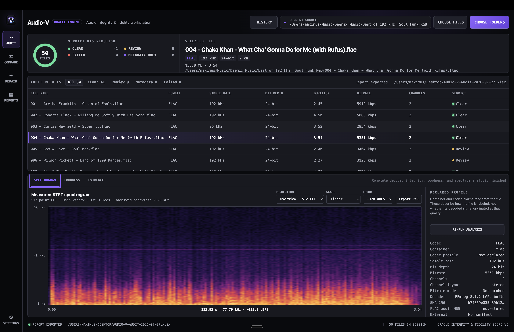
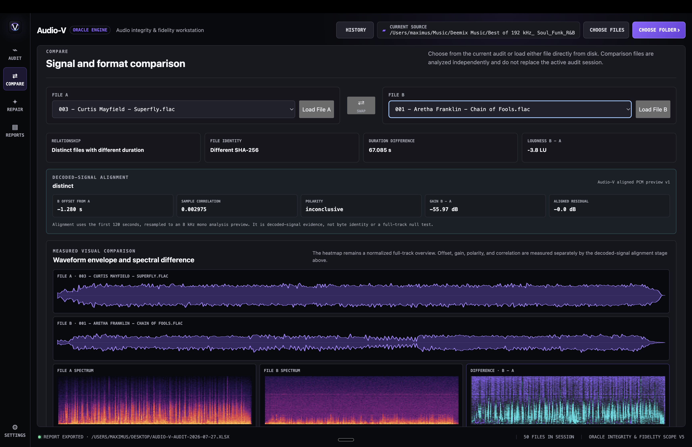
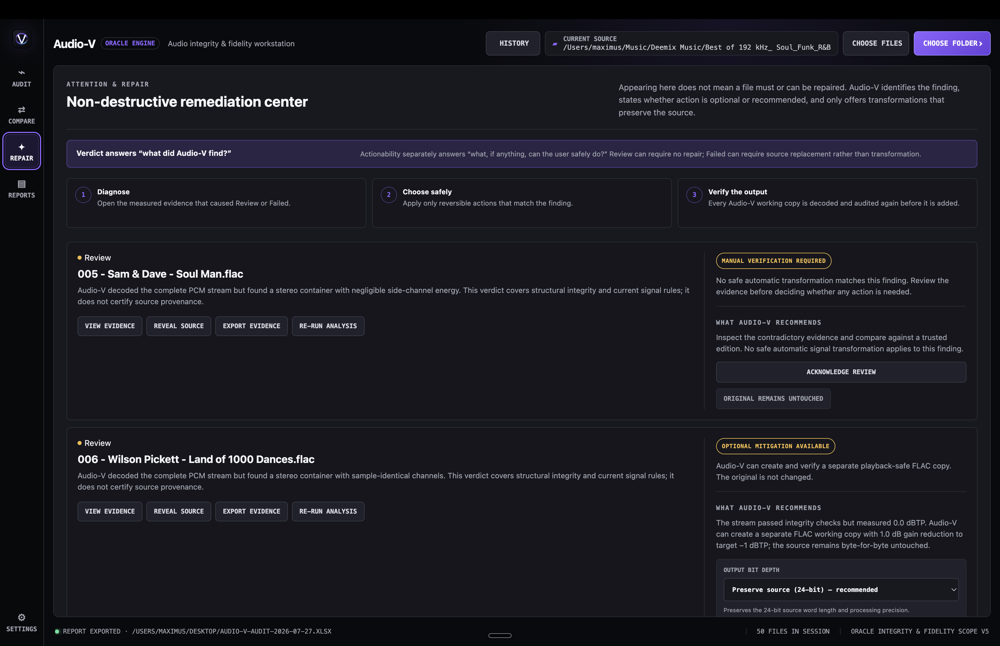
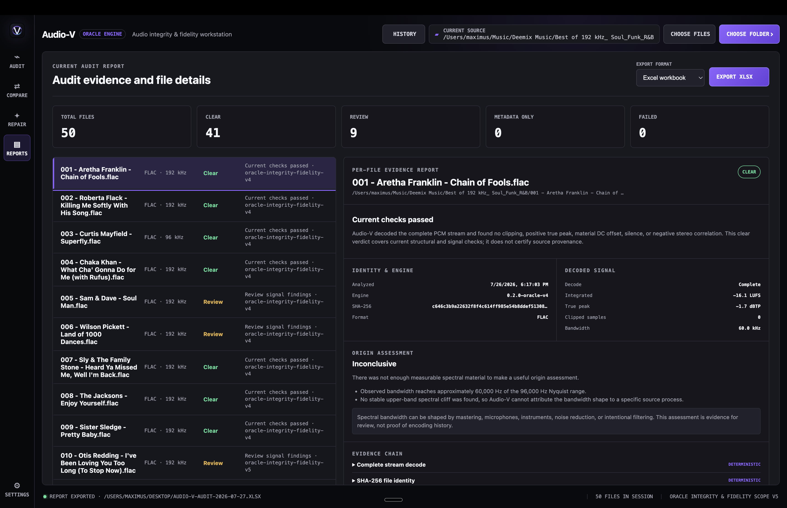

<div align="center">
  
  <h1>Audio-V</h1>
  <p><strong>The audio integrity and fidelity workstation powered by the Oracle Engine.</strong></p>
  <p>Decode every stream. Measure the signal. Inspect the evidence. Reach a defensible verdict.</p>

  <p>
    
    <a href="https://github.com/DRAZY/Audio-V/releases/tag/v0.4.15"></a>
    <a href="LICENSE"></a>
    
  </p>

  <p>
    <a href="#releases">Releases</a> ·
    <a href="#meet-the-oracle-engine">Oracle Engine</a> ·
    <a href="#what-audio-v-can-do">Features</a> ·
    <a href="#understanding-the-verdict">Verdicts</a> ·
    <a href="docs/USER_GUIDE.md">User guide</a> ·
    <a href="docs/METHODOLOGY.md">Methodology</a>
  </p>
</div>



## Know what is actually inside your audio files

Audio-V is a local, cross-platform workstation for assessing audio-file integrity, decoded-signal behavior, fidelity indicators, and file identity. Point it at one file, several files, or an entire folder and it will completely decode each supported stream before presenting a scoped **Clear**, **Review**, or **Failed** verdict.

Audio-V is deliberately not a music player, tag editor, or mastering suite. It is an evidence workstation: technical properties, hashes, checksums, loudness, true peak, clipping, continuity, channel behavior, spectrograms, provenance indicators, acoustic identity, comparisons, remediation guidance, and exportable reports are brought together in one auditable workflow.

> [!IMPORTANT]
> Audio-V is currently a development preview. Release builds have no Apple Developer ID/notarization or Windows Authenticode; macOS app bundles are ad-hoc signed for bundle integrity. A Clear verdict means the file passed Audio-V's current disclosed checks; it does not prove provenance or guarantee that audio has never been transformed.

## Releases

The latest development release is **[Audio-V 0.4.15](https://github.com/DRAZY/Audio-V/releases/tag/v0.4.15)**. It contains the complete locally built asset set:

| Platform | Download | Intended system |
|---|---|---|
| macOS | [Apple Silicon DMG](https://github.com/DRAZY/Audio-V/releases/download/v0.4.15/Audio-V-0.4.15-mac-arm64.dmg) | Native Apple Silicon |
| macOS | [Universal DMG](https://github.com/DRAZY/Audio-V/releases/download/v0.4.15/Audio-V-0.4.15-mac-universal.dmg) | Apple Silicon and Intel |
| Windows | [Windows installer](https://github.com/DRAZY/Audio-V/releases/download/v0.4.15/Audio-V-0.4.15-win-x64.exe) | Guided desktop installation |
| Windows | [Portable executable](https://github.com/DRAZY/Audio-V/releases/download/v0.4.15/Audio-V-Portable-0.4.15-x64.exe) | Run without installation |

The same version-named GitHub Release exposes block maps, [`SHA256SUMS.txt`](https://github.com/DRAZY/Audio-V/releases/download/v0.4.15/SHA256SUMS.txt), and [`UNSIGNED_RELEASE_MANIFEST.json`](https://github.com/DRAZY/Audio-V/releases/download/v0.4.15/UNSIGNED_RELEASE_MANIFEST.json). Read the [release workflow](docs/RELEASING.md) and [unsigned installation guide](docs/UNSIGNED_INSTALLATION.md) before opening an unsigned build.

## Meet the Oracle Engine

The **Oracle Engine** is Audio-V's analysis and evidence layer. It does not make a verdict from a filename, extension, bitrate label, or spectrogram alone. It moves each file through a versioned pipeline:

1. **Discover and identify** — inspect the container and primary audio stream, normalize the format label, and calculate file identity.
2. **Decode completely** — run the selected stream from beginning to end through the bundled FFmpeg 8.1.2 LGPL engine with fatal error handling.
3. **Verify integrity** — evaluate decode completion, FLAC STREAMINFO audio MD5 when present, external MD5/SHA manifests, and declared-versus-decoded duration.
4. **Inspect provenance and identity** — validate offline C2PA statements, inventory generator/signature indicators, and calculate a local Chromaprint without inventing an AI verdict.
5. **Measure the signal** — calculate level, loudness, true peak, clipping, DC offset, continuity, channel relationship, dynamics, bit utilization, waveform envelope, and spectral data.
6. **Assess fidelity indicators** — examine measured bandwidth and upper-band behavior using conservative, versioned origin rules.
7. **Assemble the evidence** — separate deterministic facts, direct measurements, and heuristic indicators before issuing a scoped verdict and explanation.

### Three kinds of evidence

| Evidence class | What it answers | Examples |
|---|---|---|
| **Deterministic** | Did a verifiable integrity or signed-statement check pass? | Complete decode, SHA-256 identity, FLAC audio MD5, external checksum manifest, C2PA validation |
| **Measured** | What is present in decoded or locally derived evidence? | LUFS, dBTP, clipping, stereo correlation, STFT spectrum, Chromaprint relationship |
| **Heuristic** | Does the signal or editable inventory match a disclosed review pattern? | Possible transcode/upsample, generator metadata, known raw identifier string |

Heuristic rule strength is not a probability of provenance. Audio-V separately reports evidence coverage and explains when an origin assessment is inconclusive. Microphones, mastering filters, instruments, noise reduction, and intentional processing can resemble codec cutoffs, so spectral evidence remains a reason to investigate—not an accusation.

### Real-world validation disclosure

Audio-V ships the current Oracle validation status with the application and displays it in Settings. The synthetic fidelity suite protects deterministic rule behavior, while a separate licensed, provenance-labeled corpus tracks independent public masters, contributor-group partitions, controlled derivatives, exact 95% binomial intervals, and versioned scorecards. Synthetic fixtures and multiple derivatives of one recording never inflate the independent-master count.

The corpus infrastructure is implemented, but the project does not claim real-world probability calibration until licensed masters and an independent challenge evaluation satisfy the published thresholds. See the [validation corpus contract](docs/VALIDATION_CORPUS.md) and [Corpus Contribution Agreement](CORPUS_CONTRIBUTION_AGREEMENT.md).

## Understanding the verdict

| Verdict | Meaning |
|---|---|
| **Clear** | The entire selected stream decoded and passed the current deterministic and measured rules. This does not certify provenance. |
| **Review** | Decoding completed, but a measured finding, checksum discrepancy, or heuristic pattern deserves human inspection. Review does not automatically mean damage or require repair. |
| **Failed** | Deterministic evidence exists against the file itself, such as decoder-reported stream corruption or a FLAC decoded-audio MD5 mismatch. |

**Not analyzed** is a workflow state, not a verdict. It means Metadata Inventory cataloged declared technical properties without decoding the signal or invoking Oracle. **Analysis error** is also separate from Failed: Audio-V shows the failed processing stage and exact diagnostic evidence, issues no file-integrity verdict, and offers a retry.

Findings such as clipping, positive true peak, digital-silence dropout candidates, near/dual mono, unusual channel correlation, and possible spectral transformation route to **Review** rather than being mislabeled as proven corruption.

## What Audio-V can do

### Audit files and complete libraries

- Choose individual files, multi-select, or recursively scan folders
- Scan user-selected removable drives and operating-system-mounted network shares, including macOS `/Volumes` locations plus Windows mapped drives and UNC paths; directory discovery uses eight bounded metadata operations, while each active remote file is transferred once with a 4 MB sequential buffer and repeatedly analyzed from temporary local storage
- Run a fast **Metadata Inventory** that catalogs declared format, codec, duration, bitrate, sample rate, bit depth, and channels while leaving every file explicitly **Not analyzed**
- Process work concurrently with pause, cancellation, saved sessions, and cache reuse
- Normalize codec/container labels and expose sample rate, bit depth, channel layout, bitrate, profile, duration, and encoder information
- Calculate SHA-256 identity and verify adjacent or folder-level MD5, SHA-1, SHA-256, and SHA-512 manifests
- Accept 39 FFmpeg-backed audio/container extensions, including AAC, AC-3/E-AC-3, AIFF, ALAC, AMR, APE, AU, CAF, DSF, FLAC, Matroska/WebM, M4A/M4B, MP2/MP3, Musepack, OGG/Opus/Speex, TAK, TTA, VOC, WAV, WMA, and WavPack. Every extension runs through a native macOS and Windows routing/capability fixture gate; 29 have generated or committed native-codec fixtures.

### Inspect decoded fidelity

- Measured 512-, 2,048-, 4,096-, and 16,384-point Hann-window STFT spectrograms
- Combined-power, left, right, and L−R channel views with zoom, pan, exact region readout, scientific colormaps, and single/batch PNG export
- EBU R128 integrated loudness and loudness range
- BS.1770 oversampled true peak
- Sample peak, RMS, clipping percentage, per-channel counts, contiguous-event timeline, possible scaled-clipping review, near clipping, DC offset, and crest factor
- Exact digital-silence runs, dropout candidates, conservative click/pop candidates, non-zero stuck-sample runs, and steep transition candidates
- Stereo correlation, side-to-mid energy, dual-mono, and near-mono assessment
- Streaming packet-rate distribution for every demuxer that reports packet size and duration, including p05/p95, deviation, coverage, and observed CBR/VBR behavior
- Conservative possible-transcode and possible-upsample review rules
- Offline C2PA Content Credentials validation with remote manifest and OCSP fetching disabled
- Known generator metadata and raw identifier inventory without an AI yes/no verdict
- Chromaprint duplicate/similarity candidates across both the current audit and a dedicated historical Identity library with browse, rebuild, missing-source prune, and clear controls, plus optional explicit AcoustID lookup
- BPM, ISRC, MusicBrainz IDs, declared ReplayGain tags, calculated ReplayGain 2.0 track/album values with eligibility explanations, independently decoded cue INDEX 01 programme tracks and INDEX 00 pregaps, DR meter, and integer bit-utilization evidence

### Automate audits

The headless CLI runs the same Oracle worker, contracts, verdict rules, and compact JSON evidence model as the desktop app:

```bash
npm run cli -- /music/archive \
  --output audit.json \
  --concurrency 2 \
  --memory-mb 256 \
  --ffmpeg-threads 2 \
  --native-memory-mb 1024 \
  --fail-on failed
```

Use `--metadata-only` for non-decoding inventory, `--fail-on review` for strict archival/CI policy, or set `AUDIO_V_ACOUSTID_KEY` to explicitly enable an external identity lookup. `--acoustid-key` is also supported, but the environment variable avoids placing a key in the command line. API keys are not written to evidence or saved source records.

Desktop packages include the same CLI at `Audio-V.app/Contents/Resources/cli/audio-v-cli` on macOS and `resources\cli\Audio-V-CLI.cmd` on Windows. It uses the bundled Oracle Engine and FFmpeg rather than requiring a source checkout.

### Compare two independent files

Load either side directly from disk or select files from the active audit. Audio-V estimates offset, gain, and polarity from a bounded alignment preview, then null-tests the complete overlapping decoded track across every matching channel. Differing layouts can use an explicit one-to-one channel map; without one, Audio-V retains the preview rather than inventing correspondence. It reports mapped per-channel null depth and coverage alongside duration, loudness, waveform envelopes, spectra, and a normalized spectral-difference heatmap.



### Review and remediate without touching the source

The Repair workspace separates **what Audio-V found** from **what can safely be done**. It can recommend replacement, comparison against a trusted edition, manual verification, acknowledgement, or optional mitigation. The available true-peak action creates a separate FLAC working copy, preserves source word length by default, retains supported metadata and artwork, and audits the output again.



### Produce evidence, not just a status

Open a complete per-file report containing identity, engine version, decoded measurements, Origin Assessment, limitations, and the evidence chain. Export a complete audit to PDF, XLSX, DOCX, CSV, or lossless JSON.



## Privacy and operating model

- Analysis runs locally; selected audio is not uploaded
- No telemetry, advertising, account requirement, or cloud lookup
- No audio player, lyrics service, equalizer, playback queue, or library recommendation system
- Session data remains in the current user's application-data directory
- Privacy-safe diagnostics omit filenames, paths, hashes, tags, and report evidence
- Source files are never overwritten by the remediation workflow

See the complete [privacy and security model](docs/PRIVACY_SECURITY.md).

## Documentation

- [User guide](docs/USER_GUIDE.md)
- [Oracle Engine methodology and limitations](docs/METHODOLOGY.md)
- [Real-world validation corpus](docs/VALIDATION_CORPUS.md)
- [Product blueprint](docs/PRODUCT_BLUEPRINT.md)
- [Capability and readiness audit](docs/PRODUCT_AUDIT.md)
- [Unsigned installation](docs/UNSIGNED_INSTALLATION.md)
- [Release workflow](docs/RELEASING.md)
- [Release-candidate checklist](docs/RELEASE_CANDIDATE_CHECKLIST.md)
- [Contributor guide](CONTRIBUTING.md)
- [Trademark policy](TRADEMARKS.md)

## Build from source

Audio-V requires Node.js 22 or newer.

```bash
git clone https://github.com/DRAZY/Audio-V.git
cd Audio-V
npm ci
npm run provision:engines
npm run dev
```

Run the complete source verification gate:

```bash
npm run verify
npm run validate:platform
npm run validate:formats
npm run verify:release-candidate
```

Create development-distribution packages:

```bash
npm run dist:mac
npm run dist:win
```

Audio-V follows the Deemix Remastered distribution model: maintainers build and verify packages on controlled local systems, then upload the exact DMGs, executables, block maps, checksum file, and signing-policy manifest directly to the versioned GitHub Release. Pushes and tags do not start hosted builds. The optional cross-platform workflow is manual-only so normal development does not consume private-repository runner allowance.

## Technology

Audio-V uses Electron, Vue 3, TypeScript, Vite, FFmpeg/ffprobe 8.1.2 LGPL builds, Vitest, SQLite-backed worker storage, and Electron Builder. The renderer is context-isolated and receives a narrow preload API rather than direct Node.js access.

## License, contributions, and official branding

Audio-V source is licensed under the [GNU Affero General Public License version 3 only](LICENSE). Dependencies and bundled engines retain their respective licenses.

Contributions require acceptance of the [Audio-V Contributor License Agreement](CONTRIBUTOR_LICENSE_AGREEMENT.md), which preserves contributor ownership while granting the project explicit relicensing rights. The Audio-V name, logo, icon, Oracle Engine identity, and official-release designation are governed separately by the [trademark policy](TRADEMARKS.md).

Audio recordings submitted for benchmark use require the separate [Validation Corpus Contribution Agreement](CORPUS_CONTRIBUTION_AGREEMENT.md); the software CLA does not grant audio or composition rights.

---

<div align="center">
  <strong>Audio-V</strong><br>
  Evidence before assumption. Measurement before verdict.
</div>
