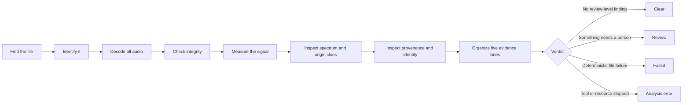

# The Oracle Engine, explained simply

The Oracle Engine is the part of Audio-V that examines an audio file and
builds its verdict. Think of it as a careful inspection line. The file passes
through several stations, and each station answers a different question.

Oracle does not decide that a file is good or bad from its name, extension,
bitrate, or one colorful graph. It decodes the audio, records measurements,
keeps different kinds of evidence separate, and explains what caused the
result.

> [!IMPORTANT]
> Oracle is an assessor, not a mind reader. It can prove some integrity
> failures, measure what is in a signal, and recognize patterns worth reviewing.
> It cannot prove who made a recording, whether it is the original studio
> master, or every step in its history.

## The short version

The colors can be understood like a traffic light:

- **Clear** means “the tested checks passed.”
- **Review** means “stop and look at this evidence.”
- **Failed** means “Audio-V has deterministic evidence against the file.”
- **Analysis error** means “Audio-V could not finish the test.”
- **Not analyzed** means “only the file’s labels and declared properties were
  inventoried.”

## The processing stages

### 1. Discovery: find the selected audio

Audio-V accepts individual files, groups of files, and folders. Folder scans
are recursive, so files inside subfolders can be found. User-selected mounted
network shares, mapped drives, and removable drives are supported.

At this stage Audio-V is finding candidates. It has not yet decided whether
the audio is healthy.

### 2. Inventory: read what the file says it is

Audio-V reads declared information such as:

- container and codec;
- duration and bitrate;
- sample rate, bit depth, and channel layout;
- title, artist, album, track number, and identifiers;
- existing ReplayGain and MusicBrainz-related tags;
- cue-sheet references.

This information is useful, but metadata can be missing, incorrect, or edited.
Oracle therefore treats it as a description, not proof.

If the user chose **Metadata inventory**, the workflow stops here. The file is
shown as **Not analyzed** because its audio signal was not decoded or judged.

### 3. File identity: give the exact bytes a fingerprint

Audio-V calculates a SHA-256 hash. A hash is like a very long serial number for
the exact bytes in a file. If one byte changes, the SHA-256 value should also
change.

SHA-256 can answer “are these file bytes identical?” It cannot answer “do
these two different files contain the same recording?” That second question
is handled later with an acoustic fingerprint and Compare.

### 4. Complete decode: read the audio from beginning to end

Oracle uses the bundled FFmpeg engine to decode the primary audio stream all
the way through. This is much stronger than merely reading the header or
collecting tags.

The first pass is strict. If it reports a file-integrity problem, Oracle tries
a tolerant confirmation pass:

- If the tolerant pass succeeds, the file is playable but structurally
  nonconformant. The result becomes **Review**.
- If both paths fail with deterministic corruption evidence, the result
  becomes **Failed**.
- If a tool is missing, times out, exceeds a resource limit, or encounters an
  internal problem, the result becomes **Analysis error**, not Failed.

This distinction prevents a computer or application problem from being blamed
on the audio file.

### 5. Integrity checks: ask whether the decoded result is internally honest

Oracle combines the decode result with available integrity evidence:

- For native FLAC files, it compares decoded audio with the audio MD5 stored
  in FLAC STREAMINFO when that value is available.
- It compares declared duration with decoded duration.
- It verifies supported external MD5, SHA-1, SHA-256, and SHA-512 checksum
  manifests when supplied.
- It retains exact evidence and the stage that produced a failure.

A FLAC audio-MD5 mismatch is deterministic evidence: the fully decoded samples
do not match the identity stored inside that FLAC. This produces **Failed**.

An external manifest mismatch produces **Review** because the manifest may be
old, wrong, or intended for a different file. It deserves investigation, but
it does not automatically prove that the audio stream itself is corrupt.

### 6. Signal measurement: measure what is actually in the sound

Oracle streams decoded PCM samples through measurement tools. It examines:

- sample peak, RMS level, integrated loudness, and loudness range;
- true peak and peak-to-loudness ratio;
- clipped samples and groups of clipping events;
- repeated plateaus that may be scaled clipping;
- click/pop and stuck-sample candidates;
- exact digital-silence regions that may be dropouts;
- DC offset and steep transitions;
- stereo correlation, dual mono, near mono, and side-to-mid energy;
- dynamic range and integer bit utilization;
- waveform and spectrogram data.

Most signal findings are not proof of file corruption. A loud master may be
intentional. A square wave can resemble clipping. A hard musical edit can
resemble a click. Oracle therefore uses thresholds and usually sends material
signal findings to **Review**, where the user can inspect the evidence.

### 7. Spectral-origin assessment: look for transformation patterns

A spectrogram shows how frequency energy changes over time. Oracle uses a
separate multi-region spectral analysis to look for patterns compatible with:

- a lossy source later saved in a lossless container; or
- audio raised to a higher sample rate without useful new upper-band content.

Oracle does not call a file transcoded or upsampled because it sees one cutoff.
The strong rule requires several independent clues, including a repeatable band
edge and corroborating upper-band behavior.

Even a strong match remains **possible**, not proven. Microphones, instruments,
analog transfers, noise reduction, intentional low-pass mastering, and other
artistic choices can create similar shapes.

Origin Assessment reports three different ideas:

- **Rule strength** says how fully the file matched the current pattern:
  none, weak, moderate, or strong.
- **Evidence coverage** says how much usable information was available.
- **Regional stability** says how consistently the band edge appeared across
  different parts of the audio.

These are not percentages of truth. Oracle does not invent a probability when
the evidence is incomplete.

### 8. Provenance and acoustic identity: inspect claims and relationships

Oracle keeps provenance separate from sound quality:

- C2PA Content Credentials are inspected locally with network retrieval
  disabled.
- Generator names and known identifier strings are inventoried.
- Chromaprint creates a local acoustic fingerprint for duplicate and
  similarity leads.
- Optional AcoustID recognition can connect a fingerprint to candidate
  MusicBrainz recording IDs.
- Independently optional MusicBrainz enrichment can describe one embedded or
  AcoustID-supplied recording ID with credited artists, ISRCs, release date,
  and release-group context.

A valid Content Credential means a signed statement is correctly attached to
the asset. It does not prove that every statement is true, that the audio is
high quality, or that the signer owns the recording.

A Chromaprint match means recordings are acoustically related. It does not mean
their file bytes, mastering, loudness, or provenance are identical.

A MusicBrainz match means the supplied recording ID exists in a
community-maintained catalog. It does not prove that an editable embedded ID or
an AcoustID candidate names the exact edition in hand, and it never changes the
Oracle verdict.

Audio-V summarizes those external clues in a parallel identity result:

| Identity result | Meaning |
| --- | --- |
| **Metadata corroborated** | The external identity agrees with every comparable declared recording ID, title, and artist field |
| **Identity matched** | AcoustID found a recording, but the file has too little comparable metadata |
| **Metadata conflict** | At least one comparable declared field disagrees with the external identity |
| **Inconclusive** | No enabled service returned a usable recording identity |

This is not a sixth Oracle verdict lane. It is a separate identity workflow
shown beside the immutable five-lane quality verdict. A recognized recording
can still be clipped, corrupted, transcoded, or incorrectly mastered.

The [AcoustID and MusicBrainz setup
guide](EXTERNAL_IDENTITY_SERVICES.md) explains how to enable these optional
services, what information they receive, and how to troubleshoot a neutral or
failed lookup.

Audio-V deliberately does not show a universal “AI: Yes/No” badge. The current
evidence cannot responsibly support that claim.

### 9. Five evidence lanes: keep unlike questions apart

Oracle v11 organizes findings into five lanes:

| Lane | Plain-language question | Examples |
|---|---|---|
| **File integrity** | Could the file be read and verified correctly? | Complete decode, FLAC audio MD5, duration consistency |
| **Signal defects** | Did the decoded sound contain material warning patterns? | Clipping, dropout candidates, click/pop candidates, DC offset |
| **Spectral origin** | Does the spectrum resemble a prior transformation? | Possible lossy transcode, possible upsample, limited bandwidth |
| **Provenance** | Are there attached claims or identity clues? | C2PA, generator metadata, raw identifiers, Chromaprint |
| **Delivery compliance** | Does the signal match a chosen delivery target? | Optional EBU R 128, ATSC A/85, or AES internet-music loudness and true-peak limits |

Keeping the lanes separate matters. Missing Content Credentials do not damage
an audio file. A possible transcode pattern does not mean the decoder failed.
A positive true peak does not prove the file is corrupt.

Delivery profiles are opt-in. Oracle records the selected reference, accepted
loudness range, maximum true peak, measured values, and qualification in the
file evidence. A profile miss produces Review because the file may be valid
audio prepared for a different destination. It never produces Failed, and it
never changes the integrity lane.

The provenance lane also distinguishes readiness from proof. A complete,
CD-frame-aligned 44.1 kHz / 16-bit / stereo lossless image plus cue layout is
labeled eligible for future CTDB or AccurateRip lookup, but it is not called
verified until a database checksum implementation returns a match. An
MQA-related metadata field or decoder profile is shown as an unauthenticated
format marker; Audio-V does not claim to unfold or authenticate proprietary
MQA data.

### 10. Verdict assembly: apply narrow precedence

Oracle uses this order:

1. Deterministic file-integrity failure produces **Failed**.
2. A processing failure produces **Analysis error**.
3. Any review-level or critical finding produces **Review**.
4. Otherwise, the completed full audit produces **Clear**.

Advisories and informational observations remain visible without changing a
Clear verdict.

### 11. Finalization: finish the library safely

After all individual files are analyzed, Audio-V may still need to link
fingerprints and commit the final session index. The progress display reserves
100% for the point when this work is durably complete.

To keep large scans bounded:

- exact track ReplayGain is calculated during each full audit;
- exact album ReplayGain is automatically calculated for sources of 1,000
  files or fewer and deferred for larger sources;
- exact fingerprint duplicates remain linked in large libraries;
- near-match expansion is deferred above 2,000 files;
- historical fingerprint storage uses at most four outstanding requests;
- selections above 100 files use indexed exact-history matching, while smaller
  selections may also inspect near-duration candidates;
- a supplemental history lookup failure becomes one audit notice and cannot
  discard completed verdicts or prevent the session from closing;
- finalization stages are named in the interface and application log.

For album ReplayGain on a large collection, audit the album or a smaller
folder directly.

## What produces Clear?

A Full Oracle Audit produces **Clear** when:

- the selected audio stream decoded completely;
- no deterministic integrity check failed;
- no current finding reached Review or Critical severity; and
- the audit—not merely metadata collection—finished successfully.

Clear may still show:

- advisory or informational observations;
- missing provenance credentials;
- an inconclusive spectral-origin assessment;
- near mono or dual mono;
- a positive true-peak delivery advisory;
- one small isolated clipping, click, or dropout candidate below the current
  material-review threshold.

Clear means “passed the disclosed tests in this version.” It does not mean
“certified original master,” “perfect sound,” or “never edited.”

## What produces Review?

Review means the complete audit finished and one or more findings deserve a
person’s attention. Current examples include:

| Finding | When it reaches Review | Why it is not automatically Failed |
|---|---|---|
| Recoverable stream error | Strict decode failed but tolerant decode completed | The stream remains decodable |
| Clipping | At least 3 clipped samples, at least 2 clipping events, or at least 0.0001% clipped samples | Clipping may be intentional mastering or synthesis |
| Possible scaled clipping | At least 12 compatible plateau samples | The shape is suggestive, not proof |
| Click/pop candidates | At least 2 candidates or one candidate with amplitude at least 0.5 full scale | Percussion and edits can look similar |
| Stuck samples | At least 2 candidates or one lasting at least 50 ms | Synthesis and test signals can look similar |
| Digital-silence dropout candidates | At least 2 internal zero-signal regions | Silence can be an intentional edit |
| DC offset | Absolute channel offset of at least 0.05 | It is a signal condition, not structural corruption |
| Duration mismatch | More than 100 ms for sample-exact lossless/PCM codecs | Container declarations can be imperfect |
| Spectral-origin pattern | Strong, multi-feature possible-transcode or possible-upsample match | Spectrum cannot prove production history |
| External checksum mismatch | Supplied manifest and current file disagree | The manifest itself may be wrong or stale |

The evidence report identifies which rule fired. A user should inspect the
signal, compare against a trusted copy when possible, and decide whether the
finding is expected.

## What produces Failed?

Failed is intentionally rare. It requires deterministic evidence against the
file itself, currently including:

- strict and tolerant complete-decode paths both failing with recognized
  corruption evidence; or
- a native FLAC’s decoded audio not matching its stored STREAMINFO audio MD5.

Failed does not mean Audio-V dislikes the mastering. It means a repeatable
integrity check contradicted the file.

## What is Analysis error?

Analysis error means Audio-V could not complete a stage because of something
such as:

- a missing or unavailable engine;
- a timeout;
- a worker crash;
- an enforced memory or output limit;
- an unclassified tool failure;
- a source that disconnected during analysis; or
- an internal processing error.

Audio-V records the stage, stable error code, and diagnostic evidence. It does
not quietly convert these conditions into file damage.

## What should I do after each result?

| Result | Sensible next step |
|---|---|
| **Clear** | Keep the report if you need a record. No action is required unless you have a separate provenance question. |
| **Review** | Open the evidence, inspect the named lane, and compare with a trusted edition if available. |
| **Failed** | Preserve the source, verify its hash, obtain another copy, and compare before deleting anything. |
| **Analysis error** | Read the failure stage, retry, check the source connection and resource settings, then export diagnostics if it repeats. |
| **Not analyzed** | Run a Full Oracle Audit when you need a verdict. |

### Oracle verdict and human disposition

The Oracle verdict is immutable evidence from the named engine version. Human
review is a separate layer. A reviewer can record:

- **Acknowledged** — seen, with no human conclusion yet.
- **Accepted as intentional** — the measured condition appears deliberate.
- **Confirmed issue** — independent inspection supports the finding.
- **Possible false positive** — human inspection disagrees with the heuristic.
- **Remediated copy verified** — a separate corrected copy was checked.
- **Replacement required** — the source should be reacquired.
- **Follow-up required** — more evidence is needed.

An optional note records what was checked. Reports retain the Oracle verdict,
human disposition, note, and timestamp as separate fields. A reviewer cannot
turn Review or Failed into Clear, suppress evidence, or claim that Audio-V
scientifically proved a heuristic interpretation.

## Evidence classes

Oracle labels how it knows each thing:

| Class | Meaning | Simple example |
|---|---|---|
| **Deterministic** | The same input and check should produce a yes/no answer | A stored FLAC audio MD5 either matches or does not |
| **Measured** | A number or behavior was observed in decoded audio | Integrated loudness is −14 LUFS |
| **Heuristic** | Several measurements match a disclosed pattern | The spectrum is compatible with a possible prior lossy encode |
| **Declared** | A tag or signed statement says something | Metadata names a generator |

The evidence class prevents a clue from being presented as proof.

## Limits that users should know

- Audio-V has no audio player.
- It does not judge musical taste or artistic quality.
- It does not prove that a file is an original studio master.
- It does not recover information removed by clipping or lossy encoding.
- It does not treat high sample rate, high bit depth, or high bitrate as
  automatic proof of quality.
- Its synthetic validation fixtures protect rule consistency, but published
  real-world accuracy rates require a licensed, provenance-labeled corpus that
  the project does not yet possess.
- Current builds are unsigned by a commercial Apple or Microsoft certificate.

For exact formulas, standards, limitations, and scientific references, read
[Oracle Engine methodology](METHODOLOGY.md). For everyday operation, read the
[user guide](USER_GUIDE.md).
